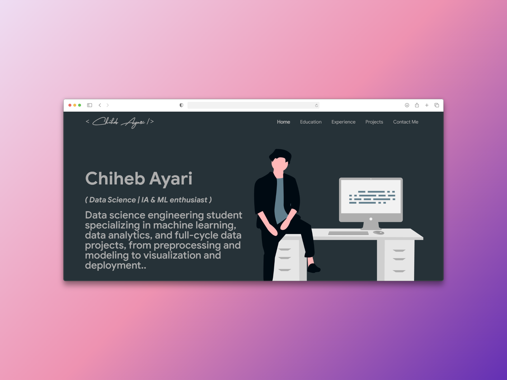

<p align="center"> 
    </img>
</p>

<h1 align="center"> Software Developer Master Portfolio 🔥 </h1> 
<h3 align="center"> A clean, beautiful, responsive, and 100% customizable portfolio <br /> template for Software Developers! </h3>

<p align="center">
  <a href="https://img.shields.io/badge/Coverage-100%25-green"></a>
  <a href="https://nodejs.org/en/blog/release/v20.11.1"></a>
  <a href="https://www.npmjs.com/package/npm/v/10.2.4"></a>
  <a href="https://reactjs.org/"></a>
  <a href="https://join.slack.com/t/masterportfolio/shared_invite/zt-g772n1fo-Ns4usanURF8jVb8wk2lRAA"></a>
  <a href="https://github.com/prettier/prettier"></a>
  <br/>
  <a href="https://app.netlify.com/sites/ashutosh1919portfolio/deploys"></a>
  <a href="https://img.shields.io/badge/building-pass-green"></a>
  <a href="https://badges.mit-license.org/"></a>
  <a href="https://github.com/ashutosh1919/masterPortfolio/commits/master"></a>
  <a href="https://badges.mit-license.org/"></a>
  <a href="https://ashutoshhathidara.com/"></a>
  <a href="https://img.shields.io/badge/price-free-ff69b4"></a>
</p>

<p align="center"> 
    <a href="https://portfolio-chiheb.vercel.app/">
         </img>
    </a>
</p>

To view a live example, **[click here](https://portfolio-chiheb.vercel.app/)**

# Clone and Use 📋

- The website is completely built on `react-js` library of `javascript` and that's why we need `nodejs` and `npm` installed
- While installing `nodejs` and `npm`, try to install versions which are equal or greater than the versions mentioned in badges above
- In case you want to help developing it or simply saving it, you can fork the repository just by clicking the button on the top-right corner of this page
- After the successful installation of `nodejs` and `npm`, clone the repository into your local system using below command:
  ```bash
   git clone https://github.com/Wissem-Sahli-Engineer/Portfolio---Chiheb
  ```
  This will clone the whole repository in your system.
- To download required dependencies to your system, navigate to the directory where the cloned repository resides and execute following command:
  ```node
  npm install
  ```
- Now the project is ready to use
- You can check it using `npm start`, it will open the website locally on your browser.

# Customize it to make your own portfolio ✏️

In this project, there are basically 4 things that you need to change to customize this to anyone else's portfolio: **package.json**, **Personal Information**, **Github Information** and **Splash Logo**.

### package.json

Open this file, which is in the main cloned directory, choose any "name" and change "homepage " to `https://<your-github-username>.github.io`. Do not forget the `https://`, otherwise fonts will not load.

### Personal Information

You will find `src/portfolio.js` file which contains the complete information about the user. The file looks something like below:

```javascript
// Home Page
const greeting = {
    ...
}

// Social Media
const socialMediaLinks = {
    ...
}

...
```

You can change the personal information, experience, education, social media, certifications, blog information, contact information etc. in `src/portfolio.js` to directly reflect them in portfolio website.

### How to change the icons on homepage under what i do section?

1. This section pulls data from `skills` in portfolio.js file.
2. Visit this website: https://icon-sets.iconify.design/
3. Search for the skill you are looking to add.
4. Select the icon of your choice.
5. Copy the text beside **Selected Icon** and replace it with `fontAwesomeClassName` of that particular softwareSkill.

#### How to use custom images instead of Iconify Icons?

1. Add a valid image file into the `public/skills` folder
2. Insert the image name into the `imageSrc` attribute of the particular softwareSkill
3. Remove the `fontAwesomeClassName` property or leave it empty because it takes precedence over `imageSrc`
4. Add custom styling to the `img` using the `style` Property

### Splash Logo

Note here that if you click [my portfolio](https://portfolio-chiheb.vercel.app/), you can see animating the logo at the beginning. I have designed that logo in [`Figma`](https://www.figma.com/) and then animated it using css.
Therefore, this part of portfolio is not customizable. But don't worry we have a solution to this problem. You have below two alternatives:

- If you want to design your own logo, then you can design it using `Figma` or `Adobe XD` or `Adobe Illustrator` or `Inkscape`. If you want to animate it, you can refer to `./src/components/Loader` directory which contains `js` and `css` files which animates the logo
- If you don't want Splash screen or you don't know how to design logo, then this option is for you

  - You can open `src/portfolio.js` file and at the top of this file you will see `settings` component as below:
    ```javascript
    // Website related settings
    const settings = {
      isSplash: true,
    };
    ```
  - Change `isSplash` from `true` to `false`
  - Now, if you see your website using `npm start`, it will directly open `home` rather than animating logo `splash` screen
  - If you design your logo in future, then edit the files in `./src/components/Loader` and then revert `isSplash` to `true` in `src/portfolio.js`.

## Other

- You need to change the website title and other descriptions in `public/index.html`
- You can define your own favicon in `public/icons` directory. If you don't have a favicon, you can generate favicons from [Favicon Generator](https://www.favicon-generator.org/) and [Favicon IO](https://favicon.io/)
- You can also edit your website preview (known as description image). Run your site locally, take a screenshot and replace with `public/icons/desc.png`. Note that your screenshot should be 1280x640 for better preview.

# Choose Theme 🌈

- You can take a look at `src/theme.js` file where all available themes are mentioned with their respective color codes
- At the bottom of this file you will see the below code:
  - `export const chosenTheme = blueTheme;`
  - You need to change the name from `blueTheme` to whatever theme you want to set your website to
  - You can define new theme similarly as other themes and you can assign name of that new defined theme to `chosenTheme`
- That's it. You just need to change the theme name and the code will take care of everything else
- Run `npm start` to check if everything is ok.

# Deployment 📦

This application can be easily deployed using modern cloud platforms like [Vercel](https://vercel.com) or [Render](https://render.com). Simply connect your GitHub repository to your preferred provider and trigger a deployment.
...

<p align="center"> 
  hey
</p>

# Technologies used 🛠️

- [React](https://reactjs.org/)
- [graphql](https://graphql.org/)
- [apollo-boost](https://www.apollographql.com/docs/react/get-started/)
- [baseui](https://github.com/uber/baseweb)
- [react-reveal](https://www.react-reveal.com/)
- [styled-components](https://styled-components.com/)

# illustrations 🍥

- [UnDraw](https://undraw.co/illustrations)

# References 👏🏻

- Some Design and Implementation Ideas are taken from [Ashutosh Hathidara's MasterPortfolio](https://github.com/ashutosh1919/masterPortfolio).
- Ashutosh Hathidara's MasterPortfolio ideas were inspired from [Saad Pasta's Portfolio Project](https://github.com/saadpasta/developerFolio).
- The Logo of MasterPortfolio is inspired from [prettier-logo](https://github.com/prettier/prettier-logo) for [prettier](https://github.com/prettier/prettier) designed by @ianstormtaylor.
